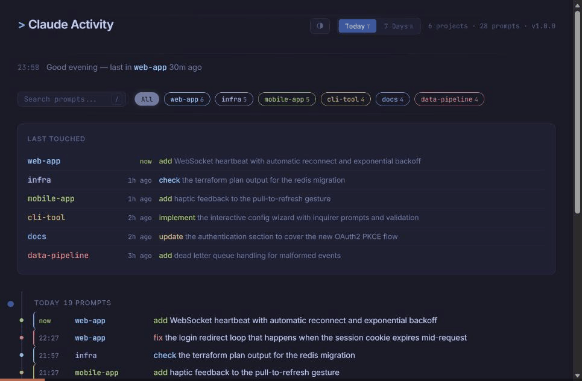

# claude-activity

A Claude Code plugin that logs your prompts and shows them in a local dashboard.

You work across multiple projects, have a meeting, come back, and can't remember what you were doing. `claude --resume` exists but doesn't give you a cross-project overview. This plugin does.

## What it looks like



- **Last Touched** — one line per project, most recent first
- **Timeline** — prompts grouped by day, filterable by project or search
- **Peek popover** — click any entry to see the full exchange: prompt, response, tool calls, duration
- **Session hover** — hover to highlight all prompts from the same session
- **Resume** — copies `cd "<project>" && claude --resume "<session>"` to clipboard
- **Keyboard shortcuts** — `j`/`k` navigate, `/` search, `r` resume, `?` help

## Install

1. In Claude Code, run `/plugins`
2. Select **Add Marketplace** and enter `git@github.com:jodli/claude-activity.git`
3. Install the `claude-activity` plugin

## Usage

Open the dashboard:

```
/claude-activity:dashboard
```

The dashboard auto-refreshes every 10 seconds. No server, no build step.

## Opting out

To exclude a project from logging:

```
touch .claude-activity-ignore
```

Opt-out is not retroactive — existing entries remain.

## Requirements

- Claude Code
- `jq` >= 1.6

## License

MIT
