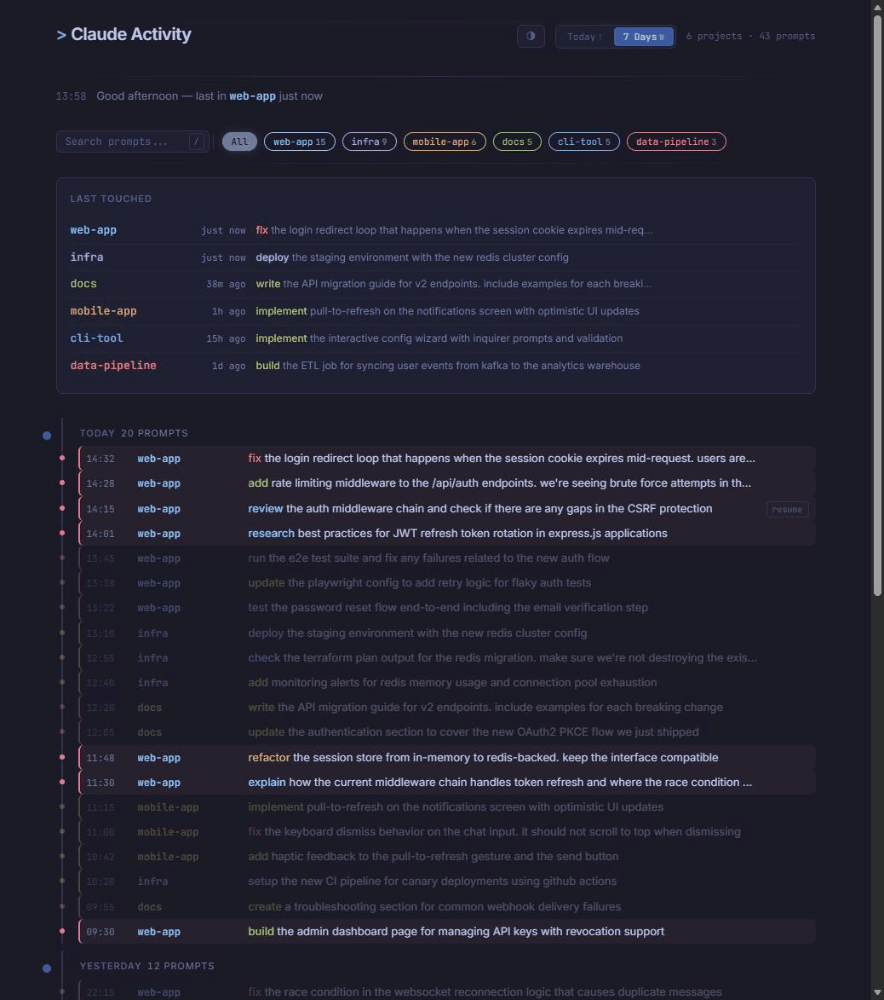

# claude-activity

A Claude Code plugin that logs your prompts and shows them in a local dashboard.

The problem: you work across multiple projects, have a meeting, come back, and can't remember which sessions you were in or what you were doing. `claude --resume` exists but doesn't give you a cross-project overview.

This plugin hooks into `UserPromptSubmit`, logs every meaningful prompt to a JSONL file, and generates a static HTML dashboard you can open in your browser.

## What it looks like



The dashboard shows:

- **Last Touched** — one line per project, most recent first, with relative time ("2h ago"). Hide projects you don't need, restore them anytime.
- **Timeline** — prompts grouped by day with timestamps and project names
- **Session indicators** — colored dots and left-border stripes show which prompts belong to the same session. Hover any entry to highlight all prompts from that session while dimming the rest.
- **Filter pills** — click a project to filter, or use the search box
- **Today / 7 Days toggle** — default shows today, switch to see the week
- **Action verb highlighting** — `fix` is red, `add` is green, `research` is blue, `refactor` is orange
- **5 themes** — Tokyo Night, Catppuccin Mocha, Kanagawa, Catppuccin Latte, Rose Pine Dawn
- **Keyboard shortcuts** — `j`/`k` to navigate, `/` to search, `r` to resume, `?` for help
- **Resume button** — copies `cd <project> && claude --resume <session>` to clipboard

Noise is filtered out automatically: short confirmations (`ja`, `ok`, `yes`), empty prompts, and bare slash commands (`/commit`) are skipped.

## Install

1. In Claude Code, run `/plugins`
2. Select **Add Marketplace** and enter `git@github.com:jodli/claude-activity.git`
3. Install the `claude-activity` plugin
4. Run `/reload-plugins` to activate

## Usage

Once installed, every prompt you type in Claude Code gets logged automatically.

Open the dashboard in your browser:

```
~/.claude/plugins/data/claude-activity-claude-activity/dashboard.html
```

Or set it as your browser's new-tab page for a "what was I working on?" overview every time you open a tab.

The dashboard auto-refreshes every 10 seconds.

## How it works

1. `UserPromptSubmit` hook fires on every prompt
2. `log-prompt.sh` extracts session ID, project, prompt text, writes to `activity.jsonl`
3. `generate-dashboard.sh` converts the JSONL to a JS file (`activity.js`)
4. `dashboard.html` loads `activity.js` and renders everything client-side

No server, no build step, no dependencies beyond `jq`.

## Requirements

- Claude Code
- `jq` (for JSON processing in the hook scripts)

## License

MIT
